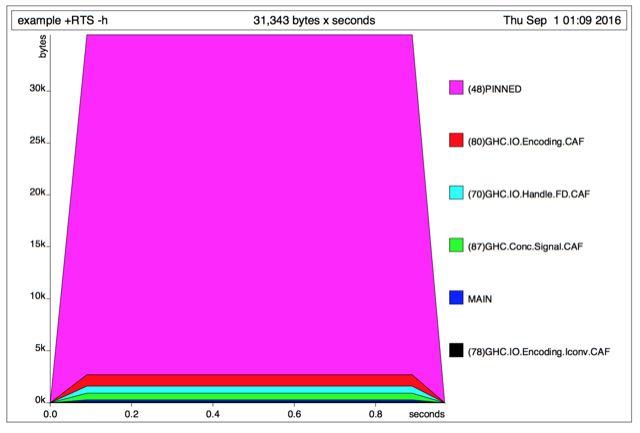

% Analyzing Events via Riak, Pipes and Foldl
% Kostiantyn Rybnikov
% November 26, 2016

# Аналізуємо події за допомогою Riak, Pipes та Foldl

# Огляд проблеми, яку вирішуємо

- Система записує складні структуровані дані у великій кількості
- Їх потрібно аналізувати, генеруючи деякий результат, візуалізацію

# Мотивація, більшість існуючих систем

- Слабка або відсутність типізації
- Не на Хаскелі
- Важко писати та підтримувати map/reduce
- Важко тестувати
- Відсутність композиції

# "Beautiful folds"

- [Beautiful folding (Max Rabkin, 2008)](http://squing.blogspot.com/2008/11/beautiful-folding.html)
- [Composable streaming folds (Gabriel Gonzalez, 2013)](http://www.haskellforall.com/2013/08/composable-streaming-folds.html)
- [foldl-1.0.0: Composable, streaming, and efficient left folds (Gabriel Gonzalez, 2013)](http://www.haskellforall.com/2013/08/foldl-100-composable-streaming-and.html)
- Популяризовано Scala-бібліотекою `algebird` , див [MuniHac 2016: Beautiful folds are practical, too](https://www.youtube.com/watch?v=6a5Ti0r8Q2s)

# Beautiful folds – проблема

```haskell
λ :{
Prelude Data.List Data.List| sum :: (Num a) => [a] -> a
Prelude Data.List Data.List| sum = foldl' (+) 0
Prelude Data.List Data.List| :}
>>> genericLength [1..100000000]
100000000
>>> sum [1..100000000]
5000000050000000
>>> let average xs = sum xs / genericLength xs
>>> average [1..100000000]
<Huge space leak>
```

# Beautiful folds – наївне вирішення

```haskell
mean :: [Double] -> Double
mean = go 0 0
  where
    go s l []     = s / fromIntegral l
    go s l (x:xs) = s `seq` l `seq`
                      go (s+x) (l+1) xs
```

# Еволюція

```haskell
foldl' :: (a -> b -> a) -> a -> [b] -> a

data Fold b c = forall a. F (a -> b -> a) a (a -> c)

data Fold b a = F (a -> b -> a) a

data Fold i o = forall m . Monoid m => Fold (i -> m) (m -> o)
```


# Beautiful folds в один слайд

Імплементація в 14 строк Хаскеля:

```haskell
{-# LANGUAGE ExistentialQuantification #-}
{-# LANGUAGE RankNTypes                #-}

import Control.Lens (Getting, foldMapOf)

data Fold i o = forall m . Monoid m => Fold (i -> m) (m -> o)

instance Functor (Fold i) where
    fmap k (Fold tally summarize) = Fold tally (k . summarize)

instance Applicative (Fold i) where
    pure o = Fold (\_ -> ()) (\_ -> o)

    Fold tallyF summarizeF <*> Fold tallyX summarizeX = Fold tally summarize
      where
        tally i = (tallyF i, tallyX i)
        summarize (mF, mX) = summarizeF mF (summarizeX mX)

focus :: (forall m . Monoid m => Getting m b a) -> Fold a o -> Fold b o
focus lens (Fold tally summarize) = Fold (foldMapOf lens tally) summarize
```

# Простий приклад

```haskell
{-# LANGUAGE ExistentialQuantification #-}

import Data.Monoid
import Prelude hiding (sum)

import qualified Data.Foldable

data Fold i o = forall m . Monoid m => Fold (i -> m) (m -> o)

fold :: Fold i o -> [i] -> o
fold (Fold tally summarize) is = summarize (reduce (map tally is))
  where
    reduce = Data.Foldable.foldl' (<>) mempty

sum :: Num n => Fold n n
sum = Fold Sum getSum
```

# Приклад використання

```haskell
>>> fold sum [1..10]
55
```

```
main :: IO ()
main = print (fold sum [(1::Int)..1000000000])
```

```bash
$ time ./example  # 0.3 ns / elem
500000000500000000

real    0m0.322s
user    0m0.316s
sys     0m0.003s
```

# Як це працює?

```haskell
print (fold sum [1, 2, 3, 4])

-- sum = Fold Sum getSum
= print (fold (Fold Sum getSum) [1, 2, 3, 4])

-- fold (Fold tally summarize) is = summarize (reduce (map tally is))
= print (getSum (reduce (map Sum [1, 2, 3, 4])))

-- reduce = foldl' (<>) mempty
= print (getSum (foldl' (<>) mempty (map Sum [1, 2, 3, 4])))

-- Definition of `map` (skipping a few steps)
= print (getSum (foldl' (<>) mempty [Sum 1, Sum 2, Sum 3, Sum 4]))

-- `foldl' (<>) mempty` (skipping a few steps)
= print (getSum (mempty <> Sum 1 <> Sum 2 <> Sum 3 <> Sum 4))

-- mempty = Sum 0
= print (getSum (Sum 0 <> Sum 1 <> Sum 2 <> Sum 3 <> Sum 4))

-- Sum x <> Sum y = Sum (x + y)
= print (getSum (Sum 10))

-- getSum (Sum x) = x
= print 10
```

# Більш цікавий приклад

```haskell
{-# LANGUAGE BangPatterns #-}

data Average a = Average { numerator :: !a, denominator :: !Int }

instance Num a => Monoid (Average a) where
    mempty = Average 0 0
    mappend (Average xL nL) (Average xR nR) = Average (xL + xR) (nL + nR)

-- Not a numerically stable average, but humor me
average :: Fractional a => Fold a a
average = Fold tally summarize
  where
    tally x = Average x 1

    summarize (Average numerator denominator) =
        numerator / fromIntegral denominator
```

# Приклад використання

```haskell
>>> fold average [1..10]
5.5
```

```haskell
main :: IO ()
main = print (fold average (map fromIntegral [(1::Int)..1000000000]))
```

```bash
$ time ./example  # 1.3 ns / elem
5.00000000067109e8

real    0m1.251s
user    0m1.237s
sys     0m0.005s
```

# Немає витоку простору!

Наша `average` працює за константну пам’ять:



# Як це працює?

```haskell
print (fold average [1, 2, 3])

-- average = Fold tally summarize
= print (fold (Fold tally summarize ) [1, 2, 3])

-- fold (Fold tally summarize) is = summarize (reduce (map tally is))
= print (summarize (reduce (map tally [1, 2, 3])))

-- reduce = foldl' (<>) mempty
= print (summarize (foldl' (<>) mempty (map tally [1, 2, 3])))

-- Definition of `map` (skipping a few steps)
= print (summarize (foldl' (<>) mempty [tally 1, tally 2, tally 3]))

-- tally x = Average x 1
= print (summarize (mconcat [Average 1 1, Average 2 1, Average 3 1]))

-- `foldl' (<>) mempty` (skipping a few steps)
= print (summarize (mempty <> Average 1 1 <> Average 2 1 <> Average 3 1))

-- mempty = Average 0 0
= print (summarize (Average 0 0 <> Average 1 1 <> Average 2 1 <> Average 3 1))

-- Average xL nL <> Average xR nR = Average (xL + xR) (nL + nR)
= print (summarize (Average 6 3))

-- summarize (Average numerator denominator) = numerator / fromIntegral denominator
= print (6 / fromIntegral 3)
```

# Прості `Fold`и

Все в `Data.Monoid` можна загорнути в `Fold`

```haskell
import Prelude hiding (head, last, all, any, sum, product, length)

head :: Fold a (Maybe a)
head = Fold (First . Just) getFirst

last :: Fold a (Maybe a)
last = Fold (Last . Just) getLast

all :: (a -> Bool) -> Fold a Bool
all predicate = Fold (All . predicate) getAll

any :: (a -> Bool) -> Fold a Bool
any predicate = Fold (Any . predicate) getAny

sum :: Num n => Fold n n
sum = Fold Sum getSum

product :: Num n => Fold n n
product = Fold Product getProduct

length :: Num n => Fold i n
length = Fold (\_ -> Sum 1) getSum
```

# Приклади використання

```haskell
>>> fold head [1..10]
Just 1
>>> fold last [1..10]
Just 10
>>> fold (all even) [1..10]
False
>>> fold (any even) [1..10]
True
>>> fold sum [1..10]
55
>>> fold product [1..10]
3628800
>>> fold length [1..10]
10
```

# Експоненційне ковзне середнє

Експоненційне ковзне середнє у вигляді `Fold`у:

```haskell
data EMA a = EMA { samples :: !Int, value :: !a }

instance Fractional a => Monoid (EMA a) where
    mempty = EMA 0 0

    mappend (EMA nL xL) (EMA 1 xR) = EMA n x  -- Optimize common case
      where
        n = nL + 1

        x = xL * 0.7 + xR
    mappend (EMA nL xL) (EMA nR xR) = EMA n x
      where
        n = nL + nR

        x = xL * (0.7 ^ nR) + xR

ema :: Fractional a => Fold a a
ema = Fold tally summarize
  where
    tally x = EMA 1 x

    summarize (EMA _ x) = x * 0.3
```

# Приклад використання

```haskell
>>> fold ema [1..10]
7.732577558099999
```

```haskell
main :: IO ()
main = print (fold ema (map fromIntegral [(1::Int)..1000000000]))
```

```bash
$ time ./example  # 2.6 ns / elem
9.999999976666665e8

real    0m2.577s
user    0m2.562s
sys     0m0.009s
```

# Оцінка кардинальності

Типове питання, що виникає — "оцінити кількість унікальних відвідувачів"

Наївне рішення:

```haskell
import Data.Set (Set)

import qualified Data.Set

uniques :: Ord i => Fold i Int
uniques = Fold Data.Set.singleton Data.Set.size
```

... потребує багато пам’яті

... погано для великих даних

# Приблизна оцінка кардинальності

Алгоритм HyperLogLog дає приблизну оцінку кардинальності

Спрощене пояснення на Хаскелі:

```haskell
import Data.Word (Word64)

import qualified Data.Bits

newtype Max a = Max { getMax :: a }

instance (Bounded a, Ord a) => Monoid (Max a) where
    mempty = Max minBound

    mappend (Max x) (Max y) = Max (max x y)

uniques :: (i -> Word64) -> Fold i Int
uniques hash = Fold tally summarize
  where
    tally x = Max (fromIntegral (Data.Bits.countLeadingZeros (hash x)) :: Word64)

    summarize (Max n) = fromIntegral (2 ^ n)
```

Справжня версія набагато більш "дужа" (Див `hyperloglog` від E. Kmett)

# Приклад використання

```haskell
main :: IO ()
main = print (fold (uniques id) (take 1000000000 (cycle randomWord64s)))

randomWord64s :: [Word64]
randomWord64s = [11244654998801660968,16946641599420530603,652086428930367189,5128055280221172986,16587432539185930121,2228570544497248004,1689089568130731485,1818807721542935601,2077177117099267269,8187447654250279125]
```

```bash
$ time ./example  # 5.5 ns / elem
16

real    0m5.543s
user    0m5.526s
sys     0m0.007s
```

# Код, що варто вкрасти

Деякі ідеї, що вкрадено зі Скала-бібліотеки `algebird`

* Quantile digests (for medians, percentiles, histograms)
    * `algebird` calls these `QTree`s
* Count-min sketch (for top N most frequently occurring items)
    * `algebird` generalizes this as `SketchMap`s
* Stochastic gradient descent (for linear regression)
    * `algebird` calls this `SGD`
* Bloom filters (for approximate membership testing)
    * `algebird` calls this `BF`

`algebird`'s version of `Fold` is called `Aggregator`

# Комбінуємо `Fold`и

Уявімо, що ми хочемо зкомбінувати два `Fold`и в один

Ми би зробили щось типу:

```haskell
combine :: Fold i a -> Fold i b -> Fold i (a, b)
combine (Fold tallyL summarizeL) (Fold tallyR summarizeR) = Fold tally summarize
  where
    tally x = (tallyL x, tallyR x)

    summarize (sL, sR) = (summarizeL sL, summarizeR sR)
```

# Приклад використання

```haskell
>>> fold (combine sum product) [1..10]
(55,3628800)
```

# `Applicative`

Можемо узагальнити `combine` написавши інстанс `Fold` для `Applicative`

```haskell
instance Functor (Fold i) where
    fmap k (Fold tally summarize) = Fold tally (k . summarize)

instance Applicative (Fold i) where
    pure o = Fold (\_ -> ()) (\_ -> o)

    Fold tallyF summarizeF <*> Fold tallyX summarizeX = Fold tally summarize
      where
        tally i = (tallyF i, tallyX i)

        summarize (mF, mX) = summarizeF mF (summarizeX mX)
```

# Строгість

Ми хочемо, аби внутрішній `Monoid` був строгим  `Pair`:

```haskell
data Pair a b = P !a !b

instance (Monoid a, Monoid b) => Monoid (Pair a b) where
    mempty = P mempty mempty

    mappend (P aL bL) (P aR bR) = P (mappend aL aR) (mappend bL bR)

data Fold i o = forall m . Monoid m => Fold (i -> m) (m -> o)

instance Functor (Fold i) where
    fmap k (Fold tally summarize) = Fold tally (k . summarize)

instance Applicative (Fold i) where
    pure o = Fold (\_ -> ()) (\_ -> o)

    Fold tallyF summarizeF <*> Fold tallyX summarizeX = Fold tally summarize
      where
        tally i = P (tallyF i) (tallyX i)

        summarize (P mF mX) = summarizeF mF (summarizeX mX)
```

Це дозволить використовувати `seq` замість `deepseq`

# Pairing values

Тепер ми можемо написати:

```haskell
combine :: Fold i a -> Fold i b -> Fold i (a, b)
combine = liftA2 (,)
```

... що має більш узагальнений тип:

```haskell
combine :: Applicative f => f a -> f b -> f (a, b)
```

Альтернативно, можемо використовувати `Applicative` напряму:

```haskell
>>> fold ((,) <$> sum <*> product) [1..10]
(55,3628800)
```

# Анти-паттерн

Порівняйте дві функції:

```haskell
bad :: [Double] -> (Double, Double)
bad xs = (Prelude.sum xs, Prelude.product xs)

good :: [Double] -> (Double, Double)
good xs = fold ((,) <$> sum <*> product) xs
```

Яка проблема в першої з них?

# Застосовуємо `Applicative`и

Можемо використовувати `Applicative`-інстанси не тільки для пар:

```haskell
sum :: Num n => Fold n n
sum = Fold Sum getSum

length :: Num n => Fold i n
length = Fold (\_ -> Sum 1) getSum

average :: Fractional n => Fold n n
average = (/) <$> sum <*> length
```

Генерує код, еквівалентний `average`, написаному "вручну":

```haskell
main :: IO ()
main = print (fold average (map fromIntegral [(1::Int)..1000000000]))
```

```bash
$ time ./example  # 1.3 ns / elem
5.00000000067109e8

real    0m1.281s
user    0m1.266s
sys     0m0.006s
```

# `Num`

Можемо надати інстанси `Fold` класам `Num`, `Fractional` та `Floating`!

```haskell
instance Num b => Num (Fold a b) where
    fromInteger n = pure (fromInteger n)

    negate = fmap negate
    abs    = fmap abs
    signum = fmap signum

    (+) = liftA2 (+)
    (*) = liftA2 (*)
    (-) = liftA2 (-)

instance Fractional b => Fractional (Fold a b) where
    fromRational n = pure (fromRational n)

    recip = fmap recip

    (/) = liftA2 (/)

instance Floating b => Floating (Fold a b) where
    pi = pure pi

    exp   = fmap exp
    sqrt  = fmap sqrt
    log   = fmap log
    sin   = fmap sin
    tan   = fmap tan
    cos   = fmap cos
    asin  = fmap sin
    atan  = fmap atan
    acos  = fmap acos
    sinh  = fmap sinh
    tanh  = fmap tanh
    cosh  = fmap cosh
    asinh = fmap asinh
    atanh = fmap atanh
    acosh = fmap acosh

    (**)    = liftA2 (**)
    logBase = liftA2 logBase
```

# Числові `Fold`и

Можемо робити круті штуки:

```haskell
>>> fold (length - 1) [1..10]
9
>>> let average = sum / length
>>> fold average [1..10]
5.5
>>> fold (sin average ^ 2 + cos average  ^ 2) [1..10]
1.0
>>> fold 99 [1..10]
99
```

# Стандартне відхилення

Формула стандартного відхилення:
$$
\sqrt{\frac{1}{N} \sum_{i=1}^N (x_i - \overline x)^2} = \sqrt{\frac{1}{N} \left(\sum_{i=1}^N x_i^2\right) - \overline{x}^2} = \sqrt{\left(\frac{1}{N}\sum_{i=1}^N x_i^2\right) - \left(\frac{1}{N}\sum_{i=1}^N x_i\right)^2}
$$
Еквівалент через `Fold` читається майже так само просто, як остання формула:

```haskell
standardDeviation :: Floating n => Fold n n
standardDeviation = sqrt ((sumOfSquares / length) - (sum / length) ^ 2)
  where
    sumOfSquares = Fold (Sum . (^2)) getSum
```

```haskell
>>> fold standardDeviation [1..100]
28.86607004772212
```

# `Fold`s are versatile

So far we've only defined one function that consumes `Fold`s:

```haskell
fold :: Fold i o -> [i] -> o
fold (Fold tally summarize) is = summarize (foldl' mappend mempty (map tally is))
```

... but the `Fold` type is rather unopinionated:

```haskell
data Fold i o = forall m . Monoid m => Fold (i -> m) (m -> o)
```

... so we can use `Fold`s in more interesting ways.

# Parallel `fold`s

We can run `Fold`s in parallel, for example:

```haskell
import Control.Parallel.Strategies

length :: Fold i Int
length = Fold (\_ -> Sum 1) getSum

average :: Fractional a => Fold a a
average = sum / fmap fromIntegral length

fold' :: Fold i o -> [[i]] -> o
fold' (Fold tally summarize) iss =
    summarize (reduce (map inner iss `using` parList rseq))
  where
    reduce   = Data.Foldable.foldl' mappend mempty
    inner is = reduce (map tally is)
```

This takes advantage of the associativity property of `Monoid`s

# Example usage

```haskell
main :: IO ()
main = print (fold' average (replicate 4 (map fromIntegral [(1::Int)..250000000])))
```

Note: this is ~7x slower than single-threaded, but scales with number of cores:

```bash
$ time ./test +RTS -N4  # 2.1 ns / elem
1.2500000026843546e8

real    0m2.104s
user    0m8.060s
sys     0m0.137s
```

Most of the slow-down is due to losing list fusion in the switch to parallelism

# Folding a `ListT`

`ListT` from the `list-transformers` package is defined like this:

```haskell
newtype ListT m a = ListT { next :: m (Step m a) }

data Step m a = Cons a (ListT m a) | Nil
```

We can fold that, too!

```haskell
{-# LANGUAGE BangPatterns #-}

import List.Transformer (ListT(..), Step(..))

import qualified System.IO

foldListT :: Monad m => Fold i o -> ListT m i -> m o
foldListT (Fold tally summarize) = go mempty
  where
    go !m l = do
        s <- next l
        case s of
            Nil       -> return (summarize m)
            Cons x l' -> go (mappend m (tally x)) l'
```

# Example usage

We can fold effectful streams this way:

```haskell
stdin :: ListT IO String
stdin = ListT (do
    eof <- System.IO.isEOF
    if eof
        then return Nil
        else do
            line <- getLine
            return (Cons line stdin) )

main :: IO ()
main = do
    n <- foldListT length stdin
    print n
```

```haskell
$ yes | head -10000000 | ./example
10000000
```

# Folding streaming libraries

This trick can be applied to other streaming libraries, too, such as:

* `conduit`
* `io-streams`
* `list-t`
* `logict`
* `machines`
* `pipes`
* `turtle`

Every `Fold` you define can be reused as-is for all of these ecosystems

# Rollups / Buckets

You don't have to fold the entire data set!

```haskell
i0 ==(tally)=> m0 ==(summarize)=> o0

i1 ==(tally)=> m1 ==(summarize)=> o1

i2 ==(tally)=> m2 ==(summarize)=> o2

i3 ==(tally)=> m3 ==(summarize)=> o3

i4 ==(tally)=> m4 ==(summarize)=> o4

i5 ==(tally)=> m5 ==(summarize)=> o5

i6 ==(tally)=> m6 ==(summarize)=> o6

i7 ==(tally)=> m7 ==(summarize)=> o7
```

You can fold data in arbitrary buckets.

For example, each data point can be folded as a single 1-element bucket.

# Rollups / Buckets

... or you can roll up data in buckets of two:

```haskell
i0 ==(tally)=> m0 \
                   (mappend)=> m01 ==(summarize)=> o01
i1 ==(tally)=> m1 /

i2 ==(tally)=> m2 \
                   (mappend)=> m23 ==(summarize)=> o23
i3 ==(tally)=> m3 /

i4 ==(tally)=> m4 \
                   (mappend)=> m45 ==(summarize)=> o45
i5 ==(tally)=> m5 /

i6 ==(tally)=> m6 \
                   (mappend)=> m67 ==(summarize)=> o67
i7 ==(tally)=> m7 /
```

# Rollups / Buckets

... or in buckets of four:

```haskell
i0 ==(tally)=> m0 \
                   (mappend)=> m01 \
i1 ==(tally)=> m1 /                 \
                                     (mappend)=> m0123 ==(summarize)=> o0123
i2 ==(tally)=> m2 \                 /
                   (mappend)=> m23 /
i3 ==(tally)=> m3 /

i4 ==(tally)=> m4 \
                   (mappend)=> m45 \
i5 ==(tally)=> m5 /                 \
                                     (mappend)=> m4567 ==(summarize)=> o4567
i6 ==(tally)=> m6 \                 /
                   (mappend)=> m67 /
i7 ==(tally)=> m7 /
```

# Rollups / Buckets

... or in buckets of eight:

```haskell
i0 ==(tally)=> m0 \
                   (mappend)=> m01 \
i1 ==(tally)=> m1 /                 \
                                     (mappend)=> m0123 \
i2 ==(tally)=> m2 \                 /                   \
                   (mappend)=> m23 /                     \
i3 ==(tally)=> m3 /                                       \
                                                           (mappend)=> m01234567 ==(summarize)=> o01234567
i4 ==(tally)=> m4 \                                       /
                   (mappend)=> m45 \                     /
i5 ==(tally)=> m5 /                 \                   /
                                     (mappend)=> m4567 /
i6 ==(tally)=> m6 \                 /
                   (mappend)=> m67 /
i7 ==(tally)=> m7 /
```

# Client-side aggregation!

You can delegate some of the `Fold` work to clients:

```
         Client 0              Server
       +----------+          +--------- ...
i00 => |  m00\    |          |
i01 => |  m01->m0 | => m0 => | m0
i02 => |  m02/    |          |   \
       +----------+          |    \
                             |     \
                             |      >m => o
         Client 1            |     /
       +----------+          |    /
i10 => |  m10\    |          |   /
i11 => |  m11->m1 | => m1 => | m1
i12 => |  m12/    |          |
       +----------+          +--------- ...
```

The clients `tally` and the server `summarize`s.  Both of them `mappend`.

# Caveats

This requires a stronger condition that your `Monoid`s are commutative.

This also requires that you run Haskell code on your clients

This also requires a change to the `Fold` type:

```haskell
data Fold i o = forall m . (Monoid m, Binary m) => Fold (i -> m) (m -> o)

instance (Binary a, Binary b) => Binary (Pair a b) where ...
```

# Questions?

* `Fold` basics
* Non-trivial `Fold`s
* Composing multiple `Fold`s into a single `Fold`
* Alternative ways to consume `Fold`s
* **Focusing in on subsets of the data**
* Conclusion

# Lenses

```haskell
{-# LANGUAGE RankNTypes #-}

import Control.Lens (Getting, foldMapOf)

focus :: (forall m . Monoid m => Getting m b a) -> Fold a o -> Fold b o
focus lens (Fold tally summarize) = Fold tally' summarize
  where
    tally' = foldMapOf lens tally
```

```haskell
focus _1 :: Fold i o -> Fold (i, x) o

focus _Just :: Fold i o -> Fold (Maybe i) o
```

# Example usage

```haskell
items1 :: [Either Int String]
items1 = [Left 1, Right "Hey", Right "Foo", Left 4, Left 10]
```

```haskell
>>> fold (focus _Left sum) items1
15
>>> fold (focus _Right length) items1
2
```

```haskell
items2 :: [Maybe (Int, String)]
items2 = [Nothing, Just (1, "Foo"), Just (2, "Bar"), Nothing, Just (5, "Baz")]
```

```haskell
>>> fold (focus (_Just . _1) product) items2
10
>>> fold (focus _Nothing length) items2
2
```

# Questions?

* `Fold` basics
* Non-trivial `Fold`s
* Composing multiple `Fold`s into a single `Fold`
* Alternative ways to consume `Fold`s
* Focusing in on subsets of the data
* **Conclusion**

# We use this trick at work!

Our work involves high-performance parallel processing of network packets

We use a central abstraction very similar to the one described in this talk

* We formulate each analysis as a `Fold`
* We combine and run `Fold`s side-by-side using `Applicative` operations
* Each `Fold` `focus`es in on just the subset data it cares about
* Automatic Parallelism!

# Conclusions

One simple and composable analysis type:

```haskell
data Fold i o = forall m . Monoid m => Fold (i -> m) (m -> o)
```

... which supports:

* `Applicative` operations
* Numeric operations
* Parallelism
* Bucketing / rollups
* `focus`
* any streaming ecosystem

... and supports many non-trivial useful analyses.
